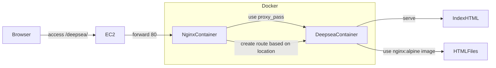

# 1台のEC2にDocker + NGINXで複数サービスを集約する実践ガイド（404を乗り越えるまで）

## リード文

「EC2をプロジェクトごとに立てるとコストがかかる」「1台にまとめたいが、構成が不安定になるのが怖い」

本記事では、**1つのEC2インスタンス上で Docker と NGINX を使い、複数の静的サイトを安全に集約する方法**を解説します。
特に、実際に遭遇した **404エラーの原因とその解決プロセス** を通して、

* コンテナの内部構造
* NGINXのlocationマッチの仕組み
* default.confの落とし穴
* proxy_passの末尾スラッシュ問題

を体系的に理解できる構成になっています。

読み終わる頃には、**自分で再現可能なマルチサービス構成**を作れる状態になります。

---

# 前提知識

以下を知っていれば十分です。

* EC2の基本操作
* Dockerの基本（build / run）
* docker compose の使い方
* NGINXがWebサーバであること

---

# 本文

---

# Context（背景・問題意識）

既存構成：

* VirtualBoxで作成 → EC2へデプロイ（静的）
* Dockerで作成 → EC2へデプロイ（静的）
* Macで作成 → EC2へデプロイ（動的）

課題：

* プロジェクトごとにEC2を立てるとコスト増大
* サーバ管理が煩雑
* 環境依存が強い

目指した構成：

```
EC2
 └ Docker
     ├ nginx（入口）
     ├ deepsea-website
     └ 他サービス（将来追加）
```

**EC2は土台。制御はコンテナに集約する。**

---

# Core Concept（中核となる考え方）

## ① EC2はただのホスト

アプリは直接置かない。

* EC2 → Dockerホスト
* Docker → 実行基盤
* NGINX → リバースプロキシ（入口）
* 各サービス → 独立コンテナ

---

## ② サービスはGit管理する

Dockerfileを必ずリポジトリに含める。

理由：

* 再現可能
* 環境がコード化される（Infrastructure as Code）
* サーバ依存を排除

---

## ③ パスベースの振り分けは“URL変換”が本質

例：

```
/deepsea/
```

を

```
/
```

としてバックエンドへ渡す必要がある。

これを正しく理解しないと404が発生する。

---

# 実装例

---

## 1️⃣ deepsea-website（静的サイト）

### ディレクトリ構成

```
deepsea-website/
├── Dockerfile
├── index.html
├── css/
├── js/
└── media/
```

### Dockerfile

```dockerfile
FROM nginx:alpine
COPY . /usr/share/nginx/html
```

---

## 2️⃣ nginxコンテナ

### Dockerfile

```dockerfile
FROM nginx:alpine

# デフォルト設定を削除（重要）
RUN rm /etc/nginx/conf.d/default.conf

COPY conf.d /etc/nginx/conf.d
COPY html /usr/share/nginx/html
```

---

## 3️⃣ deepsea-website.conf

```nginx
server {
    listen 80;

    # /deepsea → /deepsea/ にリダイレクト
    location = /deepsea {
        return 301 /deepsea/;
    }

    # deepsea-website に転送
    location /deepsea/ {
        proxy_pass http://deepsea-website/;
    }

    # 入口用
    location / {
        root /usr/share/nginx/html;
        index index.html;
    }
}
```

---

## 4️⃣ docker-compose.yml

```yaml
services:
  nginx:
    build: ./nginx
    ports:
      - "80:80"
    depends_on:
      - deepsea-website

  deepsea-website:
    build: ./deepsea-website
```

---

## 起動

```bash
docker compose down
docker compose up -d --build
```

---

# 落とし穴・注意点

---

## ❌ 404が出た原因

原因は：

```
/etc/nginx/conf.d/default.conf
```

がコンテナ内部に存在していたこと。

nginx公式イメージには最初から含まれている。

### なぜ問題になる？

nginxは：

```
conf.d/*.conf
```

をすべて読み込む。

default.confが優先されると、

```
/deepsea/
```

が正しくルーティングされない。

---

## ❗ 重要なポイント

* コンテナ内部のファイルとプロジェクトフォルダは別世界
* proxy_pass の末尾スラッシュで挙動が変わる
* `/deepsea` と `/deepsea/` は別

---

# 応用例・発展

---

## サービス追加

新しいサービスを追加する場合：

1. ディレクトリ追加
2. Dockerfile追加
3. docker-compose.ymlに追記
4. nginx設定追加

EC2は変更不要。

---

## 実務寄り構成に進化

* サブドメイン方式へ移行
* Let's Encrypt導入
* ECS + ALBへ拡張
* CI/CD導入

---

# まとめ

今回の最大の学び：

> nginx公式イメージには default.conf が存在する

そして：

* コンテナ内部構造を理解する
* URLのプレフィックス変換を理解する
* Infrastructure as Codeで管理する

この3つを理解できれば、
**1台のEC2で複数サービスを安全に集約できる。**

---

# Try It

次のことを実際に試してみてください。

1. static-siteをもう1つ追加する
2. サブドメイン方式に変更する
3. default.confをあえて残して挙動を確認する

理解は「試す」ことで定着します。

---

# 図解（mermaid）



---
