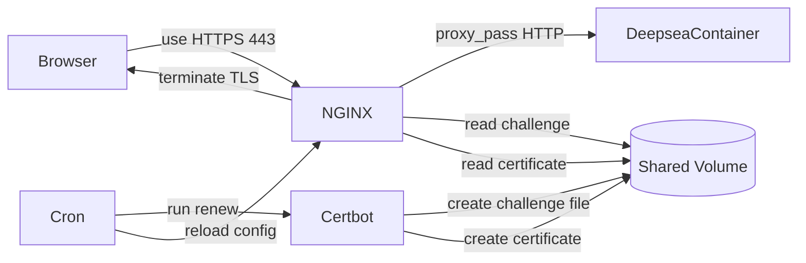

# Docker + NGINX 構成でサブドメイン方式 + HTTPS化 + 自動更新まで実装する完全ガイド

## リード文

本記事では、Docker上のNGINXリバースプロキシ構成を用いて、

* サブドメイン方式への切り替え
* Let's EncryptによるHTTPS化
* 証明書の自動更新（cron）
* 無停止でのnginx reload

までを一気通貫で実装します。

単に「動く」だけでなく、
**仕組みを理解しながら構築できること**を目的としています。

---

## 前提知識

* EC2インスタンス構築済み
* Docker / Docker Compose 導入済み
* NGINXコンテナ + アプリコンテナ構成
* deepsea.example.com がEC2のIPに向いている

---

# 本文

---

## Context（背景・問題意識）

これまでの構成はパス方式（/deepsea/）でした。

しかし本番構成では、

* deepsea.example.com
* container2.example.com

のような **サブドメイン方式** が一般的です。

さらに：

* HTTPS対応は必須
* 証明書は90日で期限切れ
* 手動更新は運用リスク

必要なのは：

> 安全・自動・無停止更新構成

---

## Core Concept（中核となる考え方）

### ① TLS終端はNGINXで行う

Browser → HTTPS(443) → NGINX → HTTP → App

アプリは暗号化不要。

---

### ② Let's Encrypt は HTTPチャレンジで所有確認する

[http://example.com/.well-known/acme-challenge/XXXX](http://example.com/.well-known/acme-challenge/XXXX)

このファイルを正しく返せないと証明書は発行されない。

---

### ③ 証明書はvolumeで永続化する

コンテナは使い捨て。

証明書は /etc/letsencrypt をホストと共有する。

---

### ④ 自動更新は cron + reload

更新時に nginx -s reload を実行。

restartではなく reload を使う。

---

# 実装例

## 1. docker-compose.yml

```yaml
services:
  nginx:
    build: ./nginx
    ports:
      - "80:80"
      - "443:443"
    volumes:
      - ./certbot/conf:/etc/letsencrypt
      - ./certbot/www:/var/www/certbot
    depends_on:
      - deepsea-website

  deepsea-website:
    build: ./deepsea-website

  certbot:
    image: certbot/certbot
    volumes:
      - ./certbot/conf:/etc/letsencrypt
      - ./certbot/www:/var/www/certbot
```

---

## 2. NGINX設定（HTTP + HTTPS）

```nginx
server {
    listen 80;
    server_name deepsea.example.com;

    location /.well-known/acme-challenge/ {
        root /var/www/certbot;
    }

    return 301 https://$host$request_uri;
}
```

```nginx
server {
    listen 443 ssl;
    server_name deepsea.example.com;

    ssl_certificate /etc/letsencrypt/live/deepsea.example.com/fullchain.pem;
    ssl_certificate_key /etc/letsencrypt/live/deepsea.example.com/privkey.pem;

    location /.well-known/acme-challenge/ {
        root /var/www/certbot;
    }

    location / {
        proxy_pass http://deepsea-website;
    }
}
```

---

## 3. 証明書発行

```bash
docker compose run --rm certbot certonly \
  --webroot \
  --webroot-path=/var/www/certbot \
  -d deepsea.example.com \
  --email your@email.com \
  --agree-tos
```

---

## 4. 自動更新設定

```bash
crontab -e
```

追加：

```bash
0 3 * * * cd /opt/projects && docker compose run --rm certbot renew && docker compose exec nginx nginx -s reload >> /var/log/letsencrypt-renew.log 2>&1
```

---

# 落とし穴・注意点

* server_name のセミコロン忘れ
* HTTPS側にもacme-challenge設定が必要
* reloadとrestartは違う

---

# まとめ

* サブドメイン方式
* HTTPS化
* 証明書自動更新
* 無停止反映

小規模本番レベルの構成が完成。

---

# Try It

* container2.example.com を追加
* HSTS設定
* HTTP/2有効化

---

# 構成図


