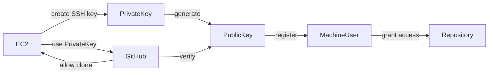

# EC2からGitHubのprivateリポジトリを安全にcloneする：Machine User + SSH鍵の完全ガイド

## リード文

EC2や本番サーバからGitHubのprivateリポジトリをcloneしたいとき、  
「Deploy Key」「Personal Access Token」「Machine User」など複数の方法があり、どれを使うべきか迷うことがあります。

本記事では、本番環境で最もスケーラブルで安全な方法である

> **Machine User + SSH鍵方式**

を使って、

- EC2からprivateリポジトリをcloneする方法
- 複数リポジトリを安全に管理する方法
- 本番運用で推奨される構成

を、仕組みから理解できるように解説します。

---

## 前提知識

以下の基本操作ができること：

- EC2へSSH接続できる
- GitHubアカウントを持っている
- Gitの基本操作（clone, push）が分かる

---

# 本文

---

## Context（背景・問題意識）

EC2からGitHubのprivateリポジトリをcloneしようとすると：

```bash
git clone git@github.com:user/private-repo.git
````

次のようなエラーが出ます：

```
Permission denied (publickey)
fatal: Could not read from remote repository.
```

これは、

> EC2はGitHubに対して「自分が誰か」を証明できていない

ためです。

---

## Core Concept（中核となる考え方）

### Machine Userとは？

Machine Userとは：

> サーバ専用のGitHubアカウント

です。

人間用アカウントではなく、

* EC2
* CI/CD
* Dockerホスト

などの機械専用のアカウントです。

---

### なぜMachine Userを使うのか？

比較：

| 方法             | 問題               |
| -------------- | ---------------- |
| Deploy Key     | リポジトリごとに鍵が必要     |
| Personal Token | セキュリティリスクが高い     |
| Machine User   | 複数repoを1つの鍵で管理可能 |

つまり：

> スケーラブルで安全

---

### SSH鍵による認証の仕組み

```
EC2 → 秘密鍵で署名
GitHub → 公開鍵で検証
一致 → 認証成功
```

パスワードは不要。

---

# 実装例

---

## Step 1：Machine Userを作成

GitHubで新しいアカウントを作る：

例：

```
ksk-aiko-bot
```

これはサーバ専用。

---

## Step 2：EC2でSSH鍵を生成

```bash
ssh-keygen -t ed25519 -C "ec2-machine-user"
```

保存先：

```
~/.ssh/id_ed25519
```

生成される：

```
id_ed25519      ← 秘密鍵
id_ed25519.pub  ← 公開鍵
```

---

## Step 3：公開鍵をGitHubに登録

公開鍵を表示：

```bash
cat ~/.ssh/id_ed25519.pub
```

コピー。

GitHubで：

```
Machine User
↓
Settings
↓
SSH and GPG Keys
↓
New SSH Key
```

貼り付け。

---

## Step 4：Machine Userにrepoアクセス権を付与

対象repo：

```
Settings
↓
Collaborators
↓
Add collaborator
↓
Machine Userを追加
```

---

## Step 5：接続確認

```bash
ssh -T git@github.com
```

成功：

```
Hi ksk-aiko-bot! You've successfully authenticated
```

---

## Step 6：clone実行

```bash
git clone git@github.com:username/repo.git
```

成功。

---

# 落とし穴・注意点

---

## Deploy Keyと混同しない

Deploy Keyは：

* repo単位
* スケーラブルでない

Machine Userは：

* アカウント単位
* 複数repo対応

---

## 秘密鍵は絶対に公開しない

公開してよいのは：

```
id_ed25519.pub
```

のみ。

---

## 正しいパーミッション

```bash
chmod 600 ~/.ssh/id_ed25519
```

---

# 応用例・発展

Machine Userは：

* EC2
* Dockerホスト
* CI/CD
* Kubernetes

などで使用可能。

本番環境の標準手法。

---

# まとめ

Machine Userを使うことで：

* 安全に認証
* 複数repo管理可能
* 本番運用対応

が実現できる。

---

# Try It

以下を実際に試してみましょう：

* Machine User作成
* SSH鍵生成
* 公開鍵登録
* repo clone

---

# 構成図



```

---
